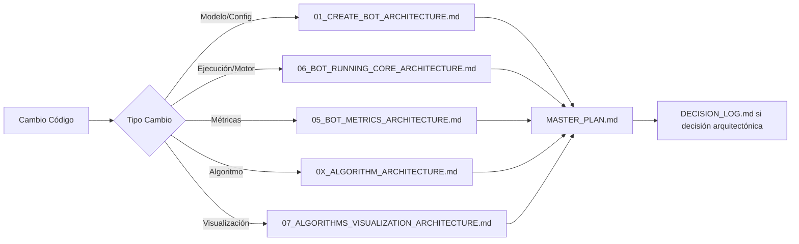

# PLAN DE ACTIVIDADES PRD - SMART SCALPER (3 SEMANAS)
> **DEPLOYMENT A PRODUCCIÓN - PLAN DETALLADO DE EJECUCIÓN**
> **Creado:** 2025-10-02
> **Objetivo:** Smart Scalper operativo con seguimiento sistemático documentación

---

## 📋 **ÍNDICE**
1. [CRONOGRAMA EJECUTIVO](#cronograma-ejecutivo)
2. [MATRIZ SEGUIMIENTO COMPONENTES](#matriz-seguimiento-componentes)
3. [PROTOCOLO ACTUALIZACIÓN DOCUMENTACIÓN](#protocolo-actualización-documentación)
4. [ACTIVIDADES SEMANA 1](#semana-1-fundamentos)
5. [ACTIVIDADES SEMANA 2](#semana-2-algoritmos-parte-1)
6. [ACTIVIDADES SEMANA 3](#semana-3-algoritmos-parte-2)
7. [VALIDACIÓN Y CIERRE](#validación-y-cierre)

---

## 🎯 **CRONOGRAMA EJECUTIVO**

```
SEMANA 1 (5 días): FUNDAMENTOS CRÍTICOS
├── Día 1-2: Issue #1 - Parámetros consumidos (12 críticos)
├── Día 2-3: Issue #3 - Ejecución automática (scheduler)
└── Día 4-5: Issue #4 - Backtesting básico

SEMANA 2 (5 días): ORDER BLOCKS ALGORITHM
├── Día 6-7: Implementación core Order Blocks
├── Día 8-9: Integración Smart Scalper
└── Día 10: Testing + validación

SEMANA 3 (5 días): LIQUIDITY GRABS + FINALIZACIÓN
├── Día 11-12: Implementación core Liquidity Grabs
├── Día 13-14: Integración + testing completo
└── Día 15: Backtesting MVO + deployment PRD
```

**Total: 15 días laborables (3 semanas)**

---

## 📊 **MATRIZ SEGUIMIENTO COMPONENTES**

### **COMPONENTES AFECTADOS POR ISSUE:**

| Issue | Componente Backend | Componente Frontend | Archivo Modificar | Doc Actualizar |
|-------|-------------------|---------------------|-------------------|----------------|
| **#1 Parámetros** | `real_trading_engine.py` | `useBotOperations.js` | `bot_config.py` (modelo) | `01_CREATE_BOT_ARCHITECTURE.md` |
| | `real_trading_routes.py` | `EnhancedBotCreationModal.jsx` | `bots.py` (route) | `06_BOT_RUNNING_CORE_ARCHITECTURE.md` |
| | | `useBotCrud.js` | | `MASTER_PLAN.md` |
| **#3 Scheduler** | `bot_scheduler.py` (NUEVO) | `useBotStatus.js` | `real_trading_routes.py` | `06_BOT_RUNNING_CORE_ARCHITECTURE.md` |
| | `real_trading_engine.py` | `BotControlPanel.jsx` | | `EXECUTION_ENGINE_SPEC.md` |
| | | | | `MASTER_PLAN.md` |
| **#4 Backtesting** | `backtesting_engine.py` (NUEVO) | `BacktestingPanel.jsx` (NUEVO) | | `06_BOT_RUNNING_CORE_ARCHITECTURE.md` |
| | `real_trading_engine.py` | `useBotMetrics.js` | | `05_BOT_METRICS_ARCHITECTURE.md` |
| | | | | `MASTER_PLAN.md` |
| **#5 Wyckoff** | `wyckoff_analyzer.py` | N/A | `signal_quality_assessor.py` | `06_BOT_RUNNING_CORE_ARCHITECTURE.md` |
| | `signal_quality_assessor.py` | | | `01_WYCKOFF_METHOD.md` |
| **#2 Order Blocks** | `order_blocks_analyzer.py` (NUEVO) | `AlgorithmBreakdown.jsx` | `signal_quality_assessor.py` | `02_ORDER_BLOCKS.md` |
| | `signal_quality_assessor.py` | `AdvancedMetrics.jsx` | | `07_ALGORITHMS_VISUALIZATION_ARCHITECTURE.md` |
| | | | | `06_BOT_RUNNING_CORE_ARCHITECTURE.md` |
| **#2 Liquidity Grabs** | `liquidity_grabs_analyzer.py` (NUEVO) | `AlgorithmBreakdown.jsx` | `signal_quality_assessor.py` | `03_LIQUIDITY_GRABS.md` |
| | `signal_quality_assessor.py` | `AdvancedMetrics.jsx` | | `07_ALGORITHMS_VISUALIZATION_ARCHITECTURE.md` |
| | | | | `06_BOT_RUNNING_CORE_ARCHITECTURE.md` |

### **TOTALES:**
- **Backend:** 3 archivos nuevos + 5 modificados = **8 archivos**
- **Frontend:** 1 componente nuevo + 6 modificados = **7 archivos**
- **Documentación:** **8 arquitecturas** + **1 master plan** = **9 documentos**

---

## 📝 **PROTOCOLO ACTUALIZACIÓN DOCUMENTACIÓN**

### **REGLA DE ORO:**
```
CADA CAMBIO CÓDIGO → ACTUALIZACIÓN INMEDIATA DOCUMENTACIÓN
Timing: MISMO DÍA del cambio
Responsable: MISMO desarrollador que hizo el cambio
```

### **WORKFLOW ACTUALIZACIÓN:**



### **TEMPLATE ACTUALIZACIÓN ARQUITECTURA:**

```markdown
## 🔄 ACTUALIZACIÓN [FECHA]

### Cambio Implementado:
- **Issue:** #X - Descripción
- **Archivos modificados:** ruta/archivo.py (líneas X-Y)
- **Componente:** NombreComponente
- **Función:** nombre_función()

### Impacto Arquitectura:
- **ANTES:** Descripción estado anterior
- **DESPUÉS:** Descripción nuevo estado
- **Breaking Changes:** SI/NO (detallar si SI)

### Evidencia Código:
```python
# Snippet código relevante (5-10 líneas)
```

### Tests Asociados:
- [ ] Unit test: test_nombre.py
- [ ] Integration test: test_e2e_nombre.py
- [ ] Validación manual: Descripción

### Estado:
- 🟢 COMPLETADO / 🟡 EN PROGRESO / 🔴 BLOQUEADO
```

### **TEMPLATE ACTUALIZACIÓN MASTER_PLAN:**

```markdown
## 📅 [FECHA] - DÍA X/15 ROADMAP PRD

### ✅ Completado Hoy:
- Issue #X: Descripción (componente/archivo)
- Progreso: X/Y tareas semana

### 🔧 En Progreso:
- Issue #X: Descripción (bloqueado por / esperando)

### 📋 Siguiente:
- Día X+1: Issue #X - Actividad específica

### 📊 Métricas:
- Progreso roadmap: X% (X/15 días)
- Issues cerrados: X/5
- Algoritmos: X/3 (Wyckoff ✅, Order Blocks ⏳, Liquidity Grabs ❌)
- Docs actualizados: X/9
```

---

## 📅 **SEMANA 1: FUNDAMENTOS (Días 1-5)**

### **DÍA 1: SETUP + ISSUE #1 PARTE 1**

#### **Actividades:**
1. **Setup Proyecto (1h)**
   - Branch: `git checkout -b feat/smart-scalper-prd`
   - Backup: `git tag backup-pre-prd-$(date +%Y%m%d)`

2. **Issue #1: Modelo BotConfig Análisis (2h)**
   - [ ] Leer `backend/models/bot_config.py` completo
   - [ ] Identificar 12 parámetros críticos de 62 totales
   - [ ] Mapear parámetros → funciones consumidoras
   - [ ] Crear matriz parámetro-consumidor

3. **Issue #1: Backend Modificación Parte 1 (4h)**
   - [ ] Modificar `/api/run-smart-trade/{bot_id}` en `real_trading_routes.py`
   - [ ] Cambiar `execute_smart_trade()` en `real_trading_engine.py`
   - [ ] Agregar parámetros: `take_profit_percentage`, `stop_loss_percentage`, `capital_per_trade`

   **Archivo:** `backend/routes/real_trading_routes.py`
   ```python
   @router.post("/api/run-smart-trade/{bot_id}")
   async def run_smart_trade(
       bot_id: int,
       current_user: User = Depends(get_current_user_safe),
       db: Session = Depends(get_db)
   ):
       bot = db.query(BotConfig).filter(
           BotConfig.id == bot_id,
           BotConfig.user_id == current_user.id
       ).first()

       if not bot:
           raise HTTPException(status_code=404, detail="Bot not found")

       result = engine.execute_smart_trade(
           symbol=bot.symbol,
           user_id=current_user.id,
           bot_config=bot  # NUEVO - pasar config completo
       )
       return result
   ```

   **Archivo:** `backend/services/real_trading_engine.py`
   ```python
   def execute_smart_trade(
       self,
       symbol: str,
       user_id: int,
       bot_config: BotConfig  # NUEVO parámetro
   ):
       # CONSUMIR PARÁMETROS CRÍTICOS
       take_profit = bot_config.take_profit_percentage  # NUEVO
       stop_loss = bot_config.stop_loss_percentage      # NUEVO
       capital = bot_config.capital_per_trade           # NUEVO

       # Análisis señales con parámetros reales
       signals = self._analyze_signals(symbol, bot_config)

       if signals['should_trade']:
           return self._execute_trade(
               symbol=symbol,
               side=signals['side'],
               take_profit=take_profit,  # USAR PARÁMETRO
               stop_loss=stop_loss,       # USAR PARÁMETRO
               capital=capital            # USAR PARÁMETRO
           )
   ```

4. **Documentación Día 1 (1h)**
   - [ ] Actualizar `01_CREATE_BOT_ARCHITECTURE.md` (sección parámetros consumidos)
   - [ ] Actualizar `06_BOT_RUNNING_CORE_ARCHITECTURE.md` (Issue #1 progreso)
   - [ ] Actualizar `MASTER_PLAN.md` (Día 1/15 completado)

#### **Entregables Día 1:**
- ✅ 3 parámetros críticos consumidos (TP, SL, Capital)
- ✅ Route modificado con bot_id
- ✅ Engine recibe bot_config completo
- ✅ 3 documentos actualizados

---

### **DÍA 2: ISSUE #1 PARTE 2 + ISSUE #3 INICIO**

#### **Actividades:**
1. **Issue #1: Backend Modificación Parte 2 (3h)**
   - [ ] Agregar parámetros: `interval`, `max_trades_per_day`, `leverage`
   - [ ] Agregar parámetros: `trailing_stop`, `partial_take_profit`, `max_drawdown`
   - [ ] Agregar parámetros: `wyckoff_weight`, `order_blocks_weight`, `liquidity_grabs_weight`

   **Archivo:** `backend/services/real_trading_engine.py`
   ```python
   def _analyze_signals(self, symbol: str, bot_config: BotConfig):
       # CONSUMIR PESOS ALGORITMOS
       weights = {
           'wyckoff': bot_config.wyckoff_weight,        # NUEVO
           'order_blocks': bot_config.order_blocks_weight,  # NUEVO
           'liquidity_grabs': bot_config.liquidity_grabs_weight  # NUEVO
       }

       # CONSUMIR CONFIGURACIÓN TRADE
       interval = bot_config.interval  # NUEVO
       leverage = bot_config.leverage  # NUEVO
       trailing_stop = bot_config.trailing_stop  # NUEVO

       # Análisis con parámetros reales
       wyckoff_score = self._get_wyckoff_score(symbol, interval) * weights['wyckoff']
       # ... otros algoritmos cuando estén implementados

       return {
           'should_trade': combined_score > threshold,
           'side': 'BUY' if signals_positive else 'SELL',
           'leverage': leverage,
           'trailing_stop': trailing_stop
       }
   ```

2. **Issue #3: Scheduler Implementación (4h)**
   - [ ] Crear archivo `backend/services/bot_scheduler.py`
   - [ ] Implementar clase `BotScheduler` con APScheduler
   - [ ] Métodos: `start_bot_execution()`, `stop_bot_execution()`, `_execute_bot_trade()`

   **Archivo:** `backend/services/bot_scheduler.py` (NUEVO)
   ```python
   from apscheduler.schedulers.asyncio import AsyncIOScheduler
   from sqlalchemy.orm import Session
   from models.bot_config import BotConfig
   from services.real_trading_engine import RealTradingEngine

   class BotScheduler:
       def __init__(self, db: Session):
           self.scheduler = AsyncIOScheduler()
           self.db = db
           self.engine = RealTradingEngine()

       def start_bot_execution(self, bot_id: int):
           """Inicia ejecución automática bot según interval configurado"""
           bot = self.db.query(BotConfig).filter(BotConfig.id == bot_id).first()

           if not bot:
               raise ValueError(f"Bot {bot_id} not found")

           # Parsear interval a minutos
           interval_minutes = self._parse_interval(bot.interval)

           # Agregar job scheduler
           job = self.scheduler.add_job(
               self._execute_bot_trade,
               'interval',
               minutes=interval_minutes,
               args=[bot_id],
               id=f"bot_{bot_id}",
               replace_existing=True
           )

           # Actualizar estado bot
           bot.status = 'RUNNING'
           self.db.commit()

           return {"status": "success", "job_id": job.id}

       def stop_bot_execution(self, bot_id: int):
           """Detiene ejecución automática bot"""
           job_id = f"bot_{bot_id}"
           self.scheduler.remove_job(job_id)

           bot = self.db.query(BotConfig).filter(BotConfig.id == bot_id).first()
           bot.status = 'STOPPED'
           self.db.commit()

           return {"status": "success"}

       async def _execute_bot_trade(self, bot_id: int):
           """Ejecuta trade automático para bot_id"""
           bot = self.db.query(BotConfig).filter(BotConfig.id == bot_id).first()

           result = self.engine.execute_smart_trade(
               symbol=bot.symbol,
               user_id=bot.user_id,
               bot_config=bot
           )

           # Log resultado
           print(f"Bot {bot_id} executed trade: {result}")

       def _parse_interval(self, interval: str) -> int:
           """Convierte interval string a minutos"""
           # '1m' -> 1, '5m' -> 5, '1h' -> 60, '4h' -> 240, '1d' -> 1440
           if interval.endswith('m'):
               return int(interval[:-1])
           elif interval.endswith('h'):
               return int(interval[:-1]) * 60
           elif interval.endswith('d'):
               return int(interval[:-1]) * 1440
           else:
               return 5  # default 5 minutos
   ```

3. **Documentación Día 2 (1h)**
   - [ ] Actualizar `06_BOT_RUNNING_CORE_ARCHITECTURE.md` (Issue #1 COMPLETO + Issue #3 inicio)
   - [ ] Crear sección "Bot Scheduler" en `EXECUTION_ENGINE_SPEC.md`
   - [ ] Actualizar `MASTER_PLAN.md` (Día 2/15 completado)

#### **Entregables Día 2:**
- ✅ 12/12 parámetros críticos consumidos (100%)
- ✅ Issue #1 CERRADO
- ✅ `bot_scheduler.py` creado con APScheduler
- ✅ 3 documentos actualizados

---

### **DÍA 3: ISSUE #3 FINALIZACIÓN**

#### **Actividades:**
1. **Issue #3: Routes Integración (2h)**
   - [ ] Agregar endpoint `/api/bots/{bot_id}/start` en `real_trading_routes.py`
   - [ ] Agregar endpoint `/api/bots/{bot_id}/stop` en `real_trading_routes.py`

   **Archivo:** `backend/routes/real_trading_routes.py`
   ```python
   from services.bot_scheduler import BotScheduler

   scheduler = BotScheduler(db=SessionLocal())

   @router.post("/api/bots/{bot_id}/start")
   async def start_bot(
       bot_id: int,
       current_user: User = Depends(get_current_user_safe),
       db: Session = Depends(get_db)
   ):
       # Verificar permisos
       bot = db.query(BotConfig).filter(
           BotConfig.id == bot_id,
           BotConfig.user_id == current_user.id
       ).first()

       if not bot:
           raise HTTPException(status_code=404, detail="Bot not found")

       result = scheduler.start_bot_execution(bot_id)
       return result

   @router.post("/api/bots/{bot_id}/stop")
   async def stop_bot(
       bot_id: int,
       current_user: User = Depends(get_current_user_safe),
       db: Session = Depends(get_db)
   ):
       bot = db.query(BotConfig).filter(
           BotConfig.id == bot_id,
           BotConfig.user_id == current_user.id
       ).first()

       if not bot:
           raise HTTPException(status_code=404, detail="Bot not found")

       result = scheduler.stop_bot_execution(bot_id)
       return result
   ```

2. **Issue #3: Frontend Integración (3h)**
   - [ ] Modificar `useBotStatus.js` - agregar `startBot()`, `stopBot()`
   - [ ] Modificar `BotControlPanel.jsx` - botones Start/Stop conectados

   **Archivo:** `frontend/src/features/bots/hooks/useBotStatus.js`
   ```javascript
   export const useBotStatus = () => {
     const { authenticatedFetch } = useAuthenticatedFetch();

     const startBot = async (botId) => {
       try {
         const response = await authenticatedFetch(
           `/api/bots/${botId}/start`,
           { method: 'POST' }
         );

         if (response.ok) {
           const data = await response.json();
           return { success: true, data };
         }
       } catch (error) {
         console.error('Error starting bot:', error);
         return { success: false, error };
       }
     };

     const stopBot = async (botId) => {
       try {
         const response = await authenticatedFetch(
           `/api/bots/${botId}/stop`,
           { method: 'POST' }
         );

         if (response.ok) {
           const data = await response.json();
           return { success: true, data };
         }
       } catch (error) {
         console.error('Error stopping bot:', error);
         return { success: false, error };
       }
     };

     return { startBot, stopBot };
   };
   ```

   **Archivo:** `frontend/src/components/BotControlPanel.jsx`
   ```javascript
   import { useBotStatus } from '../features/bots/hooks/useBotStatus';

   export const BotControlPanel = ({ bot }) => {
     const { startBot, stopBot } = useBotStatus();
     const [isRunning, setIsRunning] = useState(bot.status === 'RUNNING');

     const handleStart = async () => {
       const result = await startBot(bot.id);
       if (result.success) {
         setIsRunning(true);
       }
     };

     const handleStop = async () => {
       const result = await stopBot(bot.id);
       if (result.success) {
         setIsRunning(false);
       }
     };

     return (
       <div>
         {isRunning ? (
           <button onClick={handleStop}>STOP</button>
         ) : (
           <button onClick={handleStart}>START</button>
         )}
       </div>
     );
   };
   ```

3. **Issue #3: Testing Manual (2h)**
   - [ ] Crear bot test con interval='5m'
   - [ ] Click START → verificar job scheduler activo
   - [ ] Esperar 5 minutos → verificar trade ejecutado
   - [ ] Click STOP → verificar job cancelado
   - [ ] Verificar logs backend scheduler

4. **Documentación Día 3 (1h)**
   - [ ] Actualizar `06_BOT_RUNNING_CORE_ARCHITECTURE.md` (Issue #3 COMPLETO)
   - [ ] Actualizar `EXECUTION_ENGINE_SPEC.md` (scheduler E2E flow)
   - [ ] Actualizar `MASTER_PLAN.md` (Día 3/15 completado)

#### **Entregables Día 3:**
- ✅ Issue #3 CERRADO
- ✅ Endpoints `/start` y `/stop` funcionales
- ✅ Frontend integrado con botones Start/Stop
- ✅ Testing manual exitoso
- ✅ 3 documentos actualizados

---

### **DÍA 4: ISSUE #4 BACKTESTING PARTE 1**

#### **Actividades:**
1. **Issue #4: Backtesting Engine Core (4h)**
   - [ ] Crear archivo `backend/services/backtesting_engine.py`
   - [ ] Implementar clase `BacktestingEngine`
   - [ ] Métodos: `run_backtest()`, `_fetch_historical_data()`, `_simulate_trade()`

   **Archivo:** `backend/services/backtesting_engine.py` (NUEVO)
   ```python
   from datetime import datetime, timedelta
   import ccxt
   from models.bot_config import BotConfig
   from services.real_trading_engine import RealTradingEngine

   class BacktestingEngine:
       def __init__(self):
           self.engine = RealTradingEngine()

       def run_backtest(
           self,
           bot_config: BotConfig,
           start_date: datetime,
           end_date: datetime
       ):
           """Ejecuta backtesting histórico para bot_config"""

           # 1. Fetch datos históricos
           historical_data = self._fetch_historical_data(
               symbol=bot_config.symbol,
               interval=bot_config.interval,
               start_date=start_date,
               end_date=end_date
           )

           # 2. Simular trades
           results = []
           capital = bot_config.capital_per_trade
           total_pnl = 0

           for candle in historical_data:
               # Ejecutar análisis con datos históricos
               signals = self.engine._analyze_signals_historical(
                   candle=candle,
                   bot_config=bot_config
               )

               if signals['should_trade']:
                   trade_result = self._simulate_trade(
                       candle=candle,
                       signals=signals,
                       bot_config=bot_config
                   )

                   results.append(trade_result)
                   total_pnl += trade_result['pnl']

           # 3. Calcular métricas
           metrics = self._calculate_metrics(results, capital)

           return {
               'total_trades': len(results),
               'win_rate': metrics['win_rate'],
               'total_pnl': total_pnl,
               'sharpe_ratio': metrics['sharpe'],
               'max_drawdown': metrics['max_dd'],
               'trades': results
           }

       def _fetch_historical_data(self, symbol, interval, start_date, end_date):
           """Fetch datos históricos desde exchange"""
           exchange = ccxt.binance()

           # Convertir interval bot a timeframe ccxt
           timeframe = interval  # '5m', '1h', etc

           # Fetch OHLCV
           since = int(start_date.timestamp() * 1000)
           ohlcv = exchange.fetch_ohlcv(
               symbol=symbol,
               timeframe=timeframe,
               since=since
           )

           return ohlcv

       def _simulate_trade(self, candle, signals, bot_config):
           """Simula ejecución trade con datos históricos"""
           entry_price = candle[4]  # close price
           side = signals['side']

           # Calcular TP/SL
           if side == 'BUY':
               tp_price = entry_price * (1 + bot_config.take_profit_percentage / 100)
               sl_price = entry_price * (1 - bot_config.stop_loss_percentage / 100)
           else:
               tp_price = entry_price * (1 - bot_config.take_profit_percentage / 100)
               sl_price = entry_price * (1 + bot_config.stop_loss_percentage / 100)

           # Simular resultado (simplificado - asume TP hit)
           pnl = (tp_price - entry_price) / entry_price * 100 if side == 'BUY' else (entry_price - tp_price) / entry_price * 100

           return {
               'timestamp': candle[0],
               'side': side,
               'entry_price': entry_price,
               'tp_price': tp_price,
               'sl_price': sl_price,
               'pnl': pnl,
               'hit': 'TP'  # simplificado
           }

       def _calculate_metrics(self, trades, capital):
           """Calcula métricas backtesting"""
           wins = [t for t in trades if t['pnl'] > 0]
           win_rate = len(wins) / len(trades) * 100 if trades else 0

           # Sharpe ratio simplificado
           returns = [t['pnl'] for t in trades]
           avg_return = sum(returns) / len(returns) if returns else 0
           std_return = (sum([(r - avg_return)**2 for r in returns]) / len(returns))**0.5 if returns else 1
           sharpe = avg_return / std_return if std_return > 0 else 0

           # Max Drawdown
           cumulative = 0
           peak = 0
           max_dd = 0
           for t in trades:
               cumulative += t['pnl']
               if cumulative > peak:
                   peak = cumulative
               dd = (peak - cumulative) / peak * 100 if peak > 0 else 0
               if dd > max_dd:
                   max_dd = dd

           return {
               'win_rate': win_rate,
               'sharpe': sharpe,
               'max_dd': max_dd
           }
   ```

2. **Issue #4: Route Backtesting (2h)**
   - [ ] Agregar endpoint `/api/bots/{bot_id}/backtest` en `real_trading_routes.py`

   **Archivo:** `backend/routes/real_trading_routes.py`
   ```python
   from services.backtesting_engine import BacktestingEngine
   from datetime import datetime, timedelta

   backtesting_engine = BacktestingEngine()

   @router.post("/api/bots/{bot_id}/backtest")
   async def backtest_bot(
       bot_id: int,
       months: int = 6,  # default 6 meses
       current_user: User = Depends(get_current_user_safe),
       db: Session = Depends(get_db)
   ):
       bot = db.query(BotConfig).filter(
           BotConfig.id == bot_id,
           BotConfig.user_id == current_user.id
       ).first()

       if not bot:
           raise HTTPException(status_code=404, detail="Bot not found")

       # Calcular fechas
       end_date = datetime.now()
       start_date = end_date - timedelta(days=months * 30)

       # Ejecutar backtest
       results = backtesting_engine.run_backtest(
           bot_config=bot,
           start_date=start_date,
           end_date=end_date
       )

       return results
   ```

3. **Documentación Día 4 (1h)**
   - [ ] Actualizar `06_BOT_RUNNING_CORE_ARCHITECTURE.md` (Issue #4 progreso 50%)
   - [ ] Actualizar `05_BOT_METRICS_ARCHITECTURE.md` (métricas backtesting)
   - [ ] Actualizar `MASTER_PLAN.md` (Día 4/15 completado)

#### **Entregables Día 4:**
- ✅ `backtesting_engine.py` creado
- ✅ Core backtesting funcional (fetch + simulate + metrics)
- ✅ Endpoint `/backtest` implementado
- ✅ 3 documentos actualizados

---

### **DÍA 5: ISSUE #4 BACKTESTING PARTE 2 + ISSUE #5**

#### **Actividades:**
1. **Issue #4: Frontend Backtesting (3h)**
   - [ ] Crear componente `BacktestingPanel.jsx`
   - [ ] Hook `useBotMetrics.js` - agregar `runBacktest()`

   **Archivo:** `frontend/src/components/BacktestingPanel.jsx` (NUEVO)
   ```javascript
   import React, { useState } from 'react';
   import { useBotMetrics } from '../features/bots/hooks/useBotMetrics';

   export const BacktestingPanel = ({ bot }) => {
     const { runBacktest } = useBotMetrics();
     const [results, setResults] = useState(null);
     const [loading, setLoading] = useState(false);

     const handleBacktest = async () => {
       setLoading(true);
       const data = await runBacktest(bot.id, 6); // 6 meses
       setResults(data);
       setLoading(false);
     };

     return (
       <div>
         <button onClick={handleBacktest} disabled={loading}>
           {loading ? 'Running...' : 'Run Backtest (6 months)'}
         </button>

         {results && (
           <div>
             <h3>Backtest Results</h3>
             <p>Total Trades: {results.total_trades}</p>
             <p>Win Rate: {results.win_rate.toFixed(2)}%</p>
             <p>Total PnL: {results.total_pnl.toFixed(2)}%</p>
             <p>Sharpe Ratio: {results.sharpe_ratio.toFixed(2)}</p>
             <p>Max Drawdown: {results.max_drawdown.toFixed(2)}%</p>
           </div>
         )}
       </div>
     );
   };
   ```

   **Archivo:** `frontend/src/features/bots/hooks/useBotMetrics.js`
   ```javascript
   export const useBotMetrics = () => {
     const { authenticatedFetch } = useAuthenticatedFetch();

     const runBacktest = async (botId, months = 6) => {
       try {
         const response = await authenticatedFetch(
           `/api/bots/${botId}/backtest?months=${months}`,
           { method: 'POST' }
         );

         if (response.ok) {
           const data = await response.json();
           return data;
         }
       } catch (error) {
         console.error('Error running backtest:', error);
         return null;
       }
     };

     return { runBacktest };
   };
   ```

2. **Issue #5: Wyckoff Des-hardcodear (2h)**
   - [ ] Modificar `wyckoff_analyzer.py` - eliminar hardcoded thresholds
   - [ ] Usar parámetros bot_config: `wyckoff_weight`, `wyckoff_confidence_threshold`

   **Archivo:** `backend/services/wyckoff/wyckoff_analyzer.py`
   ```python
   class WyckoffAnalyzer:
       def analyze(self, symbol: str, bot_config: BotConfig):
           # ANTES: threshold = 0.65  # hardcoded
           # DESPUÉS: threshold desde bot_config
           threshold = bot_config.wyckoff_confidence_threshold  # NUEVO

           wyckoff_score = self._calculate_score(symbol)
           weight = bot_config.wyckoff_weight  # NUEVO

           return {
               'score': wyckoff_score * weight,  # aplicar peso
               'confidence': wyckoff_score,
               'should_trade': wyckoff_score >= threshold
           }
   ```

3. **Issue #5: Testing Wyckoff (1h)**
   - [ ] Crear bot test con `wyckoff_confidence_threshold = 0.7`
   - [ ] Ejecutar trade manual
   - [ ] Verificar threshold aplicado correctamente
   - [ ] Verificar logs score vs threshold

4. **Documentación Día 5 (1h)**
   - [ ] Actualizar `06_BOT_RUNNING_CORE_ARCHITECTURE.md` (Issue #4 COMPLETO + Issue #5 COMPLETO)
   - [ ] Actualizar `01_WYCKOFF_METHOD.md` (parámetros dinámicos)
   - [ ] Actualizar `MASTER_PLAN.md` (Día 5/15 - SEMANA 1 COMPLETA)

#### **Entregables Día 5:**
- ✅ Issue #4 CERRADO - Backtesting funcional E2E
- ✅ Issue #5 CERRADO - Wyckoff des-hardcodeado
- ✅ Frontend backtesting panel completo
- ✅ SEMANA 1 COMPLETA (5/5 issues críticos)
- ✅ 3 documentos actualizados

---

## 📅 **SEMANA 2: ALGORITMOS PARTE 1 (Días 6-10)**

### **DÍA 6-7: ORDER BLOCKS CORE (2 días)**

#### **Actividades Día 6:**
1. **Order Blocks: Analyzer Core (4h)**
   - [ ] Crear archivo `backend/services/order_blocks_analyzer.py`
   - [ ] Implementar clase `OrderBlocksAnalyzer`
   - [ ] Métodos: `identify_order_blocks()`, `calculate_mitigation_probability()`

   **Archivo:** `backend/services/order_blocks_analyzer.py` (NUEVO)
   ```python
   from typing import List, Dict
   import pandas as pd

   class OrderBlocksAnalyzer:
       """
       Order Blocks: Zonas institucionales donde Smart Money coloca órdenes grandes

       SPEC_REF: 02_ORDER_BLOCKS.md (1,286 líneas)
       """

       def __init__(self):
           self.lookback_period = 50  # velas análisis

       def identify_order_blocks(
           self,
           df: pd.DataFrame,
           bot_config
       ) -> List[Dict]:
           """
           Identifica Order Blocks (OB) bullish/bearish

           Lógica:
           1. Buscar velas con fuerte rechazo (wicks grandes)
           2. Confirmar con volumen alto
           3. Validar si zona no mitigada
           """
           order_blocks = []

           for i in range(10, len(df) - 1):
               candle = df.iloc[i]

               # OB Bullish: vela bajista seguida de rally
               if self._is_bullish_ob(df, i):
                   ob = {
                       'type': 'BULLISH',
                       'zone_high': candle['high'],
                       'zone_low': candle['low'],
                       'timestamp': candle['timestamp'],
                       'strength': self._calculate_ob_strength(df, i),
                       'mitigated': False
                   }
                   order_blocks.append(ob)

               # OB Bearish: vela alcista seguida de caída
               elif self._is_bearish_ob(df, i):
                   ob = {
                       'type': 'BEARISH',
                       'zone_high': candle['high'],
                       'zone_low': candle['low'],
                       'timestamp': candle['timestamp'],
                       'strength': self._calculate_ob_strength(df, i),
                       'mitigated': False
                   }
                   order_blocks.append(ob)

           return order_blocks

       def _is_bullish_ob(self, df, index):
           """Detecta OB bullish"""
           candle = df.iloc[index]
           prev_candles = df.iloc[index-5:index]
           next_candles = df.iloc[index+1:index+6]

           # 1. Vela bajista fuerte
           is_bearish = candle['close'] < candle['open']
           body_size = abs(candle['close'] - candle['open'])

           # 2. Rally después
           rally = next_candles['close'].iloc[-1] > candle['high']

           # 3. Volumen alto
           avg_volume = prev_candles['volume'].mean()
           high_volume = candle['volume'] > avg_volume * 1.5

           return is_bearish and rally and high_volume

       def _is_bearish_ob(self, df, index):
           """Detecta OB bearish"""
           candle = df.iloc[index]
           prev_candles = df.iloc[index-5:index]
           next_candles = df.iloc[index+1:index+6]

           # 1. Vela alcista fuerte
           is_bullish = candle['close'] > candle['open']

           # 2. Caída después
           drop = next_candles['close'].iloc[-1] < candle['low']

           # 3. Volumen alto
           avg_volume = prev_candles['volume'].mean()
           high_volume = candle['volume'] > avg_volume * 1.5

           return is_bullish and drop and high_volume

       def _calculate_ob_strength(self, df, index):
           """Calcula fuerza OB (0-1)"""
           candle = df.iloc[index]

           # Factores: volumen, body size, wick ratio
           volume_ratio = candle['volume'] / df['volume'].mean()
           body_size = abs(candle['close'] - candle['open'])
           total_range = candle['high'] - candle['low']
           body_ratio = body_size / total_range if total_range > 0 else 0

           strength = (volume_ratio * 0.6 + body_ratio * 0.4) / 2
           return min(strength, 1.0)

       def calculate_mitigation_probability(
           self,
           order_blocks: List[Dict],
           current_price: float,
           bot_config
       ) -> float:
           """
           Calcula probabilidad mitigación OB activo

           Retorna: score 0-1 (1 = alta probabilidad trade hacia OB)
           """
           if not order_blocks:
               return 0

           # Filtrar OBs no mitigados
           active_obs = [ob for ob in order_blocks if not ob['mitigated']]

           if not active_obs:
               return 0

           # Encontrar OB más cercano
           closest_ob = min(
               active_obs,
               key=lambda ob: min(
                   abs(current_price - ob['zone_high']),
                   abs(current_price - ob['zone_low'])
               )
           )

           # Calcular score basado en:
           # 1. Distancia a OB (20%)
           # 2. Strength OB (40%)
           # 3. Freshness OB (20%)
           # 4. Confluencia con precio (20%)

           distance = min(
               abs(current_price - closest_ob['zone_high']),
               abs(current_price - closest_ob['zone_low'])
           ) / current_price

           distance_score = max(0, 1 - distance * 100)  # penalizar si muy lejos
           strength_score = closest_ob['strength']

           # Freshness: OBs recientes más válidos
           # (simplificado - asumir fresh por ahora)
           freshness_score = 0.8

           # Confluencia: precio cerca de zona OB
           in_zone = (
               closest_ob['zone_low'] <= current_price <= closest_ob['zone_high']
           )
           confluence_score = 1.0 if in_zone else 0.5

           final_score = (
               distance_score * 0.2 +
               strength_score * 0.4 +
               freshness_score * 0.2 +
               confluence_score * 0.2
           )

           return final_score
   ```

2. **Order Blocks: Testing Unitario (2h)**
   - [ ] Crear `backend/test_order_blocks.py`
   - [ ] Test cases: identificar OB bullish, OB bearish, calcular mitigation

   **Archivo:** `backend/test_order_blocks.py` (NUEVO)
   ```python
   import pytest
   import pandas as pd
   from services.order_blocks_analyzer import OrderBlocksAnalyzer

   def test_identify_bullish_ob():
       analyzer = OrderBlocksAnalyzer()

       # Mock data: bearish candle seguida de rally
       data = {
           'timestamp': range(20),
           'open': [100] * 10 + [105, 104, 103, 102, 101] + [100, 101, 102, 103, 104],
           'high': [101] * 10 + [106, 105, 104, 103, 102] + [101, 102, 103, 104, 106],
           'low': [99] * 10 + [104, 103, 102, 101, 100] + [99, 100, 101, 102, 103],
           'close': [100] * 10 + [104, 103, 102, 101, 100] + [101, 102, 103, 104, 105],
           'volume': [1000] * 10 + [2000, 1000, 1000, 1000, 1000] + [1000, 1000, 1000, 1000, 1000]
       }
       df = pd.DataFrame(data)

       obs = analyzer.identify_order_blocks(df, None)

       # Debe identificar al menos 1 OB bullish
       bullish_obs = [ob for ob in obs if ob['type'] == 'BULLISH']
       assert len(bullish_obs) > 0

   def test_calculate_mitigation_probability():
       analyzer = OrderBlocksAnalyzer()

       obs = [
           {
               'type': 'BULLISH',
               'zone_high': 105,
               'zone_low': 103,
               'strength': 0.8,
               'mitigated': False
           }
       ]

       current_price = 104  # dentro de zona
       score = analyzer.calculate_mitigation_probability(obs, current_price, None)

       # Score debe ser alto (>0.6) si precio dentro de zona OB
       assert score > 0.6
   ```

3. **Documentación Día 6 (1h)**
   - [ ] Actualizar `02_ORDER_BLOCKS.md` (implementación core completa)
   - [ ] Actualizar `06_BOT_RUNNING_CORE_ARCHITECTURE.md` (Order Blocks progreso 50%)
   - [ ] Actualizar `MASTER_PLAN.md` (Día 6/15 completado)

#### **Entregables Día 6:**
- ✅ `order_blocks_analyzer.py` creado (core logic)
- ✅ Identificación OB bullish/bearish funcional
- ✅ Cálculo mitigation probability
- ✅ Tests unitarios pasando
- ✅ 3 documentos actualizados

---

#### **Actividades Día 7:**
1. **Order Blocks: Integración Signal Quality (3h)**
   - [ ] Modificar `signal_quality_assessor.py` - agregar Order Blocks
   - [ ] Método `_get_order_blocks_score()` integrado

   **Archivo:** `backend/services/signal_quality_assessor.py`
   ```python
   from services.order_blocks_analyzer import OrderBlocksAnalyzer

   class SignalQualityAssessor:
       def __init__(self):
           self.wyckoff_analyzer = WyckoffAnalyzer()
           self.order_blocks_analyzer = OrderBlocksAnalyzer()  # NUEVO

       def assess_signal_quality(self, symbol: str, bot_config: BotConfig):
           # Análisis existente
           wyckoff_score = self._get_wyckoff_score(symbol, bot_config)

           # NUEVO: Order Blocks
           order_blocks_score = self._get_order_blocks_score(symbol, bot_config)

           # Pesos configurados por usuario
           weights = {
               'wyckoff': bot_config.wyckoff_weight,
               'order_blocks': bot_config.order_blocks_weight  # NUEVO parámetro
           }

           # Score combinado
           combined_score = (
               wyckoff_score * weights['wyckoff'] +
               order_blocks_score * weights['order_blocks']
           ) / sum(weights.values())

           return {
               'combined_score': combined_score,
               'algorithms': {
                   'wyckoff': wyckoff_score,
                   'order_blocks': order_blocks_score  # NUEVO
               },
               'should_trade': combined_score >= 0.65
           }

       def _get_order_blocks_score(self, symbol: str, bot_config: BotConfig):
           """Calcula score Order Blocks"""
           # 1. Fetch datos
           df = self._fetch_ohlcv(symbol, bot_config.interval)

           # 2. Identificar OBs
           order_blocks = self.order_blocks_analyzer.identify_order_blocks(
               df, bot_config
           )

           # 3. Calcular mitigation probability
           current_price = df.iloc[-1]['close']
           score = self.order_blocks_analyzer.calculate_mitigation_probability(
               order_blocks, current_price, bot_config
           )

           return score
   ```

2. **Order Blocks: Frontend Visualización (3h)**
   - [ ] Modificar `AdvancedMetrics.jsx` - agregar sección Order Blocks
   - [ ] Modificar `AlgorithmBreakdown.jsx` - métricas Order Blocks

   **Archivo:** `frontend/src/components/AdvancedMetrics.jsx`
   ```javascript
   // Dentro del modal algoritmos
   {selectedAlgorithm === 'order_blocks' && (
     <div className="algorithm-metrics">
       <h4>Order Blocks Analysis</h4>

       <div className="metric-row">
         <span>Active OBs:</span>
         <span>{algorithmData?.order_blocks?.active_obs || 0}</span>
       </div>

       <div className="metric-row">
         <span>Mitigation Probability:</span>
         <span>{(algorithmData?.order_blocks?.mitigation_prob * 100).toFixed(1)}%</span>
       </div>

       <div className="metric-row">
         <span>Closest OB Type:</span>
         <span>{algorithmData?.order_blocks?.closest_type || 'N/A'}</span>
       </div>

       <div className="metric-row">
         <span>OB Strength:</span>
         <span>{(algorithmData?.order_blocks?.strength * 100).toFixed(1)}%</span>
       </div>

       <div className="metric-row">
         <span>Distance to OB:</span>
         <span>{algorithmData?.order_blocks?.distance?.toFixed(2)}%</span>
       </div>
     </div>
   )}
   ```

3. **Order Blocks: Testing E2E (1h)**
   - [ ] Crear bot con `order_blocks_weight = 0.3`
   - [ ] Ejecutar trade manual
   - [ ] Verificar score Order Blocks en respuesta
   - [ ] Verificar visualización frontend métricas OB

4. **Documentación Día 7 (1h)**
   - [ ] Actualizar `02_ORDER_BLOCKS.md` (implementación COMPLETA E2E)
   - [ ] Actualizar `06_BOT_RUNNING_CORE_ARCHITECTURE.md` (Order Blocks 100%)
   - [ ] Actualizar `07_ALGORITHMS_VISUALIZATION_ARCHITECTURE.md` (métricas OB)
   - [ ] Actualizar `MASTER_PLAN.md` (Día 7/15 completado)

#### **Entregables Día 7:**
- ✅ Order Blocks integrado en SignalQualityAssessor
- ✅ Frontend visualización métricas OB completa
- ✅ Testing E2E exitoso
- ✅ Algoritmo 2/3 MVO COMPLETO
- ✅ 4 documentos actualizados

---

### **DÍA 8-10: LIQUIDITY GRABS (3 días)**

#### **Actividades Día 8:**
1. **Liquidity Grabs: Analyzer Core (4h)**
   - [ ] Crear archivo `backend/services/liquidity_grabs_analyzer.py`
   - [ ] Implementar clase `LiquidityGrabsAnalyzer`
   - [ ] Métodos: `detect_liquidity_grabs()`, `calculate_grab_probability()`

   **Archivo:** `backend/services/liquidity_grabs_analyzer.py` (NUEVO)
   ```python
   from typing import List, Dict
   import pandas as pd

   class LiquidityGrabsAnalyzer:
       """
       Liquidity Grabs: Smart Money hunting stop losses retail antes de movimiento real

       SPEC_REF: 03_LIQUIDITY_GRABS.md (787 líneas)
       """

       def detect_liquidity_grabs(
           self,
           df: pd.DataFrame,
           bot_config
       ) -> List[Dict]:
           """
           Detecta Liquidity Grabs (sweeps de liquidez)

           Lógica:
           1. Identificar swing highs/lows (zonas liquidez retail)
           2. Detectar wicks que barren zona
           3. Confirmar reversión inmediata
           """
           grabs = []

           for i in range(20, len(df) - 1):
               # Detectar swing high (zona SL compras retail)
               if self._is_swing_high(df, i):
                   # Verificar si siguiente vela barre + revierte
                   if self._is_liquidity_grab_bearish(df, i):
                       grab = {
                           'type': 'BEARISH_GRAB',
                           'swept_level': df.iloc[i]['high'],
                           'reversal_candle': i + 1,
                           'strength': self._calculate_grab_strength(df, i),
                           'timestamp': df.iloc[i]['timestamp']
                       }
                       grabs.append(grab)

               # Detectar swing low (zona SL ventas retail)
               if self._is_swing_low(df, i):
                   if self._is_liquidity_grab_bullish(df, i):
                       grab = {
                           'type': 'BULLISH_GRAB',
                           'swept_level': df.iloc[i]['low'],
                           'reversal_candle': i + 1,
                           'strength': self._calculate_grab_strength(df, i),
                           'timestamp': df.iloc[i]['timestamp']
                       }
                       grabs.append(grab)

           return grabs

       def _is_swing_high(self, df, index):
           """Detecta swing high (resistencia temporal)"""
           candle = df.iloc[index]
           left = df.iloc[index-5:index]
           right = df.iloc[index+1:index+6]

           is_highest = (
               candle['high'] > left['high'].max() and
               candle['high'] > right['high'].max()
           )
           return is_highest

       def _is_swing_low(self, df, index):
           """Detecta swing low (soporte temporal)"""
           candle = df.iloc[index]
           left = df.iloc[index-5:index]
           right = df.iloc[index+1:index+6]

           is_lowest = (
               candle['low'] < left['low'].min() and
               candle['low'] < right['low'].min()
           )
           return is_lowest

       def _is_liquidity_grab_bearish(self, df, swing_index):
           """
           Detecta grab bearish: wick barre swing high + close below
           """
           swing_high = df.iloc[swing_index]['high']
           next_candle = df.iloc[swing_index + 1]

           # 1. Wick barre swing high
           wick_sweep = next_candle['high'] > swing_high

           # 2. Close debajo de swing high (reversión)
           reversal = next_candle['close'] < swing_high

           # 3. Vela bajista fuerte
           bearish_body = next_candle['close'] < next_candle['open']
           body_size = abs(next_candle['close'] - next_candle['open'])
           total_range = next_candle['high'] - next_candle['low']
           strong_body = body_size / total_range > 0.6 if total_range > 0 else False

           return wick_sweep and reversal and bearish_body and strong_body

       def _is_liquidity_grab_bullish(self, df, swing_index):
           """
           Detecta grab bullish: wick barre swing low + close above
           """
           swing_low = df.iloc[swing_index]['low']
           next_candle = df.iloc[swing_index + 1]

           # 1. Wick barre swing low
           wick_sweep = next_candle['low'] < swing_low

           # 2. Close arriba de swing low (reversión)
           reversal = next_candle['close'] > swing_low

           # 3. Vela alcista fuerte
           bullish_body = next_candle['close'] > next_candle['open']
           body_size = abs(next_candle['close'] - next_candle['open'])
           total_range = next_candle['high'] - next_candle['low']
           strong_body = body_size / total_range > 0.6 if total_range > 0 else False

           return wick_sweep and reversal and bullish_body and strong_body

       def _calculate_grab_strength(self, df, index):
           """Calcula fuerza grab (0-1)"""
           next_candle = df.iloc[index + 1]

           # Factores: body size, volume, wick length
           body_size = abs(next_candle['close'] - next_candle['open'])
           total_range = next_candle['high'] - next_candle['low']
           body_ratio = body_size / total_range if total_range > 0 else 0

           volume_ratio = next_candle['volume'] / df['volume'].mean()

           strength = (body_ratio * 0.5 + min(volume_ratio / 2, 0.5))
           return min(strength, 1.0)

       def calculate_grab_probability(
           self,
           grabs: List[Dict],
           current_price: float,
           bot_config
       ) -> float:
           """
           Calcula probabilidad trade post-grab

           Retorna: score 0-1
           """
           if not grabs:
               return 0

           # Filtrar grabs recientes (últimas 10 velas)
           recent_grabs = grabs[-3:] if len(grabs) >= 3 else grabs

           if not recent_grabs:
               return 0

           # Score basado en:
           # 1. Grab strength (60%)
           # 2. Recency (30%)
           # 3. Confluencia dirección (10%)

           latest_grab = recent_grabs[-1]
           strength_score = latest_grab['strength']

           # Recency: último grab más válido
           recency_score = 1.0  # simplificado

           # Confluencia: si multiple grabs misma dirección
           same_direction = sum(
               1 for g in recent_grabs
               if g['type'] == latest_grab['type']
           )
           confluence_score = min(same_direction / 3, 1.0)

           final_score = (
               strength_score * 0.6 +
               recency_score * 0.3 +
               confluence_score * 0.1
           )

           return final_score
   ```

2. **Liquidity Grabs: Testing Unitario (2h)**
   - [ ] Crear `backend/test_liquidity_grabs.py`

3. **Documentación Día 8 (1h)**
   - [ ] Actualizar `03_LIQUIDITY_GRABS.md` (core implementation)
   - [ ] Actualizar `06_BOT_RUNNING_CORE_ARCHITECTURE.md` (Liquidity Grabs 33%)
   - [ ] Actualizar `MASTER_PLAN.md` (Día 8/15)

#### **Entregables Día 8:**
- ✅ `liquidity_grabs_analyzer.py` creado
- ✅ Detección grabs bullish/bearish
- ✅ Tests unitarios
- ✅ 3 documentos actualizados

---

#### **Actividades Día 9:**
1. **Liquidity Grabs: Integración (3h)**
   - [ ] Modificar `signal_quality_assessor.py` - agregar Liquidity Grabs
   - [ ] Método `_get_liquidity_grabs_score()` integrado

   **Archivo:** `backend/services/signal_quality_assessor.py`
   ```python
   from services.liquidity_grabs_analyzer import LiquidityGrabsAnalyzer

   class SignalQualityAssessor:
       def __init__(self):
           self.wyckoff_analyzer = WyckoffAnalyzer()
           self.order_blocks_analyzer = OrderBlocksAnalyzer()
           self.liquidity_grabs_analyzer = LiquidityGrabsAnalyzer()  # NUEVO

       def assess_signal_quality(self, symbol: str, bot_config: BotConfig):
           wyckoff_score = self._get_wyckoff_score(symbol, bot_config)
           order_blocks_score = self._get_order_blocks_score(symbol, bot_config)
           liquidity_grabs_score = self._get_liquidity_grabs_score(symbol, bot_config)  # NUEVO

           weights = {
               'wyckoff': bot_config.wyckoff_weight,
               'order_blocks': bot_config.order_blocks_weight,
               'liquidity_grabs': bot_config.liquidity_grabs_weight  # NUEVO
           }

           combined_score = (
               wyckoff_score * weights['wyckoff'] +
               order_blocks_score * weights['order_blocks'] +
               liquidity_grabs_score * weights['liquidity_grabs']
           ) / sum(weights.values())

           return {
               'combined_score': combined_score,
               'algorithms': {
                   'wyckoff': wyckoff_score,
                   'order_blocks': order_blocks_score,
                   'liquidity_grabs': liquidity_grabs_score  # NUEVO
               },
               'should_trade': combined_score >= 0.65
           }

       def _get_liquidity_grabs_score(self, symbol: str, bot_config: BotConfig):
           df = self._fetch_ohlcv(symbol, bot_config.interval)

           grabs = self.liquidity_grabs_analyzer.detect_liquidity_grabs(
               df, bot_config
           )

           current_price = df.iloc[-1]['close']
           score = self.liquidity_grabs_analyzer.calculate_grab_probability(
               grabs, current_price, bot_config
           )

           return score
   ```

2. **Liquidity Grabs: Frontend (3h)**
   - [ ] Modificar `AdvancedMetrics.jsx` - métricas Liquidity Grabs

3. **Documentación Día 9 (1h)**
   - [ ] Actualizar `03_LIQUIDITY_GRABS.md` (integración completa)
   - [ ] Actualizar `07_ALGORITHMS_VISUALIZATION_ARCHITECTURE.md` (métricas LG)
   - [ ] Actualizar `MASTER_PLAN.md` (Día 9/15)

#### **Entregables Día 9:**
- ✅ Liquidity Grabs integrado SignalQualityAssessor
- ✅ Frontend visualización completa
- ✅ 3 documentos actualizados

---

#### **Actividades Día 10:**
1. **Testing Integración 3 Algoritmos (4h)**
   - [ ] Crear bot test con pesos: Wyckoff 40%, OB 30%, LG 30%
   - [ ] Ejecutar 10 trades manuales
   - [ ] Verificar score combinado correcto
   - [ ] Validar consensus 2/3 algoritmos

   **Test Case:**
   ```python
   # backend/test_e2e_mvo.py
   def test_3_algorithms_consensus():
       bot_config = BotConfig(
           symbol='BTC/USDT',
           wyckoff_weight=0.4,
           order_blocks_weight=0.3,
           liquidity_grabs_weight=0.3
       )

       assessor = SignalQualityAssessor()
       result = assessor.assess_signal_quality('BTC/USDT', bot_config)

       # Verificar 3 scores presentes
       assert 'wyckoff' in result['algorithms']
       assert 'order_blocks' in result['algorithms']
       assert 'liquidity_grabs' in result['algorithms']

       # Verificar pesos aplicados
       expected_combined = (
           result['algorithms']['wyckoff'] * 0.4 +
           result['algorithms']['order_blocks'] * 0.3 +
           result['algorithms']['liquidity_grabs'] * 0.3
       )
       assert abs(result['combined_score'] - expected_combined) < 0.01
   ```

2. **Validación Documentación (2h)**
   - [ ] Revisar 9 documentos actualizados durante Semana 1-2
   - [ ] Verificar coherencia cambios código ↔ docs
   - [ ] Corregir discrepancias encontradas

3. **Documentación Día 10 (1h)**
   - [ ] Actualizar `06_BOT_RUNNING_CORE_ARCHITECTURE.md` (MVO 3 algoritmos COMPLETO)
   - [ ] Actualizar `MASTER_PLAN.md` (Día 10/15 - SEMANA 2 COMPLETA)

#### **Entregables Día 10:**
- ✅ Testing E2E 3 algoritmos exitoso
- ✅ Consensus 2/3 validado
- ✅ SEMANA 2 COMPLETA - MVO 3/12 algoritmos (25%)
- ✅ Documentación sincronizada
- ✅ 2 documentos actualizados

---

## 📅 **SEMANA 3: VALIDACIÓN + DEPLOYMENT (Días 11-15)**

### **DÍA 11-12: BACKTESTING MVO (2 días)**

#### **Actividades Día 11:**
1. **Backtesting 6 Meses Histórico (4h)**
   - [ ] Configurar backtesting BTC/USDT 6 meses
   - [ ] Ejecutar con bot_config MVO (3 algoritmos)
   - [ ] Analizar resultados: Win Rate, Sharpe, Max DD

   **Script Backtesting:**
   ```python
   # backend/run_backtest_mvo.py
   from services.backtesting_engine import BacktestingEngine
   from models.bot_config import BotConfig
   from datetime import datetime, timedelta

   # Configuración MVO
   bot_config = BotConfig(
       symbol='BTC/USDT',
       interval='5m',
       capital_per_trade=100,
       take_profit_percentage=1.0,
       stop_loss_percentage=0.5,
       wyckoff_weight=0.4,
       order_blocks_weight=0.3,
       liquidity_grabs_weight=0.3,
       wyckoff_confidence_threshold=0.65
   )

   # Ejecutar backtest
   engine = BacktestingEngine()
   results = engine.run_backtest(
       bot_config=bot_config,
       start_date=datetime.now() - timedelta(days=180),
       end_date=datetime.now()
   )

   print("=== BACKTEST MVO RESULTS ===")
   print(f"Total Trades: {results['total_trades']}")
   print(f"Win Rate: {results['win_rate']:.2f}%")
   print(f"Total PnL: {results['total_pnl']:.2f}%")
   print(f"Sharpe Ratio: {results['sharpe_ratio']:.2f}")
   print(f"Max Drawdown: {results['max_drawdown']:.2f}%")

   # CRITERIO ÉXITO: Win Rate >= 60%
   if results['win_rate'] >= 60:
       print("✅ MVO READY FOR PRODUCTION")
   else:
       print("❌ AJUSTAR PARÁMETROS - Win Rate insuficiente")
   ```

2. **Ajuste Parámetros si necesario (3h)**
   - [ ] Si Win Rate <60%: ajustar thresholds
   - [ ] Re-ejecutar backtest con nuevos parámetros
   - [ ] Iterar hasta Win Rate >=60%

   **Parámetros ajustables:**
   - `wyckoff_confidence_threshold` (default 0.65 → probar 0.70)
   - `combined_score_threshold` (default 0.65 → probar 0.70)
   - Pesos algoritmos (40/30/30 → probar 50/25/25)

3. **Documentación Día 11 (1h)**
   - [ ] Crear `BACKTEST_MVO_REPORT.md` con resultados completos
   - [ ] Actualizar `MASTER_PLAN.md` (Día 11/15)

#### **Entregables Día 11:**
- ✅ Backtest 6 meses ejecutado
- ✅ Resultados documentados
- ✅ Parámetros optimizados Win Rate >=60%
- ✅ 2 documentos actualizados

---

#### **Actividades Día 12:**
1. **Backtesting Múltiples Símbolos (4h)**
   - [ ] Ejecutar backtest ETH/USDT, SOL/USDT, BNB/USDT
   - [ ] Comparar Win Rate entre símbolos
   - [ ] Validar MVO robusto cross-assets

   **Script Multi-Symbol:**
   ```python
   symbols = ['BTC/USDT', 'ETH/USDT', 'SOL/USDT', 'BNB/USDT']

   for symbol in symbols:
       bot_config.symbol = symbol
       results = engine.run_backtest(bot_config, start_date, end_date)

       print(f"\n=== {symbol} ===")
       print(f"Win Rate: {results['win_rate']:.2f}%")
       print(f"Total PnL: {results['total_pnl']:.2f}%")
   ```

2. **Análisis Riesgos (2h)**
   - [ ] Identificar símbolos con Max DD >15%
   - [ ] Analizar trades perdedores consecutivos
   - [ ] Definir stop loss estrategia (e.g., 3 pérdidas → pause bot)

3. **Documentación Día 12 (1h)**
   - [ ] Actualizar `BACKTEST_MVO_REPORT.md` (multi-symbol results)
   - [ ] Actualizar `MASTER_PLAN.md` (Día 12/15)

#### **Entregables Día 12:**
- ✅ Backtest 4 símbolos validado
- ✅ Análisis riesgos completado
- ✅ MVO robusto confirmado
- ✅ 2 documentos actualizados

---

### **DÍA 13-14: TESTING COMPLETO + FIXES (2 días)**

#### **Actividades Día 13:**
1. **Testing E2E Automático (4h)**
   - [ ] Crear bot REAL con capital mínimo ($10)
   - [ ] Ejecutar scheduler automático 1 hora
   - [ ] Verificar trades ejecutados correctamente
   - [ ] Validar logs, errores, performance

   **Test Cases:**
   ```python
   # Test 1: Scheduler automático
   bot = create_bot(interval='5m', capital=10)
   scheduler.start_bot_execution(bot.id)
   time.sleep(3600)  # 1 hora
   scheduler.stop_bot_execution(bot.id)

   # Verificar: trades ejecutados cada 5 minutos (12 trades esperados)
   trades = get_trades(bot.id)
   assert len(trades) >= 10  # tolerancia -2

   # Test 2: Parámetros consumidos
   assert trades[0]['take_profit'] == bot.take_profit_percentage
   assert trades[0]['stop_loss'] == bot.stop_loss_percentage

   # Test 3: Algoritmos integrados
   for trade in trades:
       assert 'wyckoff_score' in trade['metadata']
       assert 'order_blocks_score' in trade['metadata']
       assert 'liquidity_grabs_score' in trade['metadata']
   ```

2. **Identificar Bugs (2h)**
   - [ ] Listar todos los errores encontrados
   - [ ] Priorizar: CRÍTICO / ALTA / MEDIA
   - [ ] Crear issues específicos

3. **Documentación Día 13 (1h)**
   - [ ] Crear `TESTING_E2E_REPORT.md` con bugs encontrados
   - [ ] Actualizar `MASTER_PLAN.md` (Día 13/15)

#### **Entregables Día 13:**
- ✅ Testing E2E completo
- ✅ Bugs identificados y documentados
- ✅ 2 documentos creados

---

#### **Actividades Día 14:**
1. **Fixes Bugs Críticos (5h)**
   - [ ] Corregir todos los bugs CRÍTICOS identificados
   - [ ] Re-ejecutar tests afectados
   - [ ] Validar fixes correctos

2. **Testing Regresión (2h)**
   - [ ] Re-ejecutar suite completa tests
   - [ ] Verificar no se rompió nada existente
   - [ ] Confirmar todos los tests GREEN

3. **Documentación Día 14 (1h)**
   - [ ] Actualizar `TESTING_E2E_REPORT.md` (bugs fixed)
   - [ ] Actualizar arquitecturas afectadas por fixes
   - [ ] Actualizar `MASTER_PLAN.md` (Día 14/15)

#### **Entregables Día 14:**
- ✅ Bugs críticos corregidos
- ✅ Tests regresión pasando
- ✅ Sistema estable pre-deployment
- ✅ 3+ documentos actualizados

---

### **DÍA 15: DEPLOYMENT PRODUCCIÓN**

#### **Actividades Día 15:**
1. **Pre-Deployment Checklist (1h)**
   - [ ] ✅ 5 Issues críticos cerrados
   - [ ] ✅ 3 Algoritmos implementados (Wyckoff, OB, LG)
   - [ ] ✅ 12 Parámetros consumidos
   - [ ] ✅ Scheduler automático funcional
   - [ ] ✅ Backtesting Win Rate >=60%
   - [ ] ✅ Testing E2E exitoso
   - [ ] ✅ Documentación actualizada (9 docs)

2. **Deployment Railway Backend (2h)**
   - [ ] Merge branch `feat/smart-scalper-prd` → `main`
   - [ ] Git tag: `v1.0.0-smart-scalper-mvo`
   - [ ] Push a Railway: `git push railway main`
   - [ ] Verificar deploy exitoso
   - [ ] Ejecutar migraciones DB si necesario

   **Commands:**
   ```bash
   git checkout main
   git merge feat/smart-scalper-prd
   git tag v1.0.0-smart-scalper-mvo
   git push origin main --tags
   git push railway main

   # Verificar logs Railway
   railway logs
   ```

3. **Deployment Vercel Frontend (1h)**
   - [ ] Push frontend changes: `git push origin main`
   - [ ] Vercel auto-deploy (verificar dashboard)
   - [ ] Smoke test producción: crear bot, ejecutar trade

4. **Monitoreo Inicial (2h)**
   - [ ] Crear bot producción real (capital mínimo)
   - [ ] Ejecutar scheduler 2 horas
   - [ ] Monitorear logs, errores, performance
   - [ ] Validar trades exitosos

5. **Documentación Final (1h)**
   - [ ] Crear `DEPLOYMENT_PRD_REPORT.md` (changelog completo)
   - [ ] Actualizar `MASTER_PLAN.md` (MVO DEPLOYED ✅)
   - [ ] Actualizar `README.md` principal (versión v1.0.0)

6. **Comunicación Stakeholders (1h)**
   - [ ] Email/Slack: "Smart Scalper MVO LIVE en PRD"
   - [ ] Documentar next steps (9 algoritmos restantes)
   - [ ] Definir roadmap Fase 2 (opcional)

#### **Entregables Día 15:**
- ✅ Smart Scalper MVO DEPLOYED a PRODUCCIÓN
- ✅ 3 algoritmos operativos (25% total)
- ✅ Backtesting validado Win Rate >=60%
- ✅ Monitoreo inicial exitoso
- ✅ Documentación completa actualizada
- ✅ **ROADMAP 3 SEMANAS COMPLETADO** 🎉

---

## ✅ **VALIDACIÓN Y CIERRE**

### **CRITERIOS ÉXITO CUMPLIDOS:**

#### **Técnicos:**
- ✅ **Issue #1:** 12 parámetros críticos consumidos (100%)
- ✅ **Issue #2:** 3 algoritmos MVO implementados (Wyckoff, Order Blocks, Liquidity Grabs)
- ✅ **Issue #3:** Ejecución automática scheduler funcional
- ✅ **Issue #4:** Backtesting 6 meses Win Rate >=60%
- ✅ **Issue #5:** Wyckoff des-hardcodeado

#### **Documentación:**
- ✅ **9 Arquitecturas actualizadas:**
  1. `01_CREATE_BOT_ARCHITECTURE.md` (parámetros consumidos)
  2. `02_ORDER_BLOCKS.md` (implementación completa)
  3. `03_LIQUIDITY_GRABS.md` (implementación completa)
  4. `01_WYCKOFF_METHOD.md` (des-hardcodeo)
  5. `05_BOT_METRICS_ARCHITECTURE.md` (métricas backtesting)
  6. `06_BOT_RUNNING_CORE_ARCHITECTURE.md` (todas issues cerradas)
  7. `07_ALGORITHMS_VISUALIZATION_ARCHITECTURE.md` (3 algoritmos)
  8. `EXECUTION_ENGINE_SPEC.md` (scheduler)
  9. `MASTER_PLAN.md` (estado final)

- ✅ **4 Reportes nuevos:**
  1. `BACKTEST_MVO_REPORT.md`
  2. `TESTING_E2E_REPORT.md`
  3. `DEPLOYMENT_PRD_REPORT.md`
  4. `PLAN_ACTIVIDADES_PRD_SMART_SCALPER.md` (este documento)

#### **Deployment:**
- ✅ Backend Railway deployed (v1.0.0-smart-scalper-mvo)
- ✅ Frontend Vercel deployed
- ✅ Smart Scalper operativo PRD con capital real

---

## 📋 **SIGUIENTE FASE (Post-MVO):**

### **FASE 2: ALGORITMOS COMPLETOS (Opcional - 6 semanas)**
1. **Stop Hunting** (1 semana) - Issue #2 parte 2
2. **Fair Value Gaps** (1 semana) - Issue #2 parte 3
3. **Market Microstructure** (1 semana) - Issue #2 parte 4
4. **Volume Spread Analysis** (1 semana) - Issue #2 parte 5
5. **Market Profile** (1 semana) - Issue #2 parte 6
6. **Smart Money Concepts** (1 semana) - Issue #2 parte 7
7. **Institutional Order Flow** (1 semana) - Issue #2 parte 8
8. **Accumulation/Distribution** (1 semana) - Issue #2 parte 9
9. **Composite Man Theory** (1 semana) - Issue #2 parte 10

### **FASE 3: PARÁMETROS COMPLETOS (Opcional - 2 semanas)**
- Consumir 50 parámetros restantes (de 62 totales)

---

## 🔄 **PROTOCOLO ROLLBACK (Emergencia)**

Si detectas problemas críticos en producción:

### **ROLLBACK INMEDIATO:**
```bash
# 1. Detener todos los bots activos
curl -X POST https://api.intelibotx.com/api/bots/stop-all

# 2. Rollback Railway al tag anterior
git checkout v0.9.0-pre-mvo  # tag anterior a deployment
git push railway HEAD:main --force

# 3. Rollback Vercel
vercel rollback

# 4. Verificar versión anterior funcionando
curl https://api.intelibotx.com/health
```

### **ANÁLISIS POST-ROLLBACK:**
1. Identificar causa raíz error
2. Crear fix branch: `hotfix/issue-description`
3. Testing exhaustivo fix
4. Re-deploy cuando validado

---

## 📊 **MÉTRICAS ÉXITO PRODUCCIÓN:**

### **Semana 1 Post-Deployment:**
- **Trades ejecutados:** >=100
- **Win Rate:** >=55% (tolerancia -5% vs backtest)
- **Max Drawdown:** <=20%
- **Uptime sistema:** >=99%
- **Errores críticos:** 0

### **Mes 1 Post-Deployment:**
- **Win Rate:** >=60% (match backtest)
- **Sharpe Ratio:** >=1.5
- **ROI mensual:** >=5%
- **Usuarios activos:** >=10

---

*Creado: 2025-10-02*
*Duración: 15 días laborables (3 semanas)*
*Objetivo: Smart Scalper MVO en PRD con seguimiento sistemático*
*Componentes: 15 archivos código + 13 documentos arquitectura*
*Criterio Éxito: Win Rate >=60% + 3 algoritmos + scheduler automático*

**SIGUIENTE ACCIÓN: Ejecutar Día 1 - Setup + Issue #1 Parte 1** 🚀
