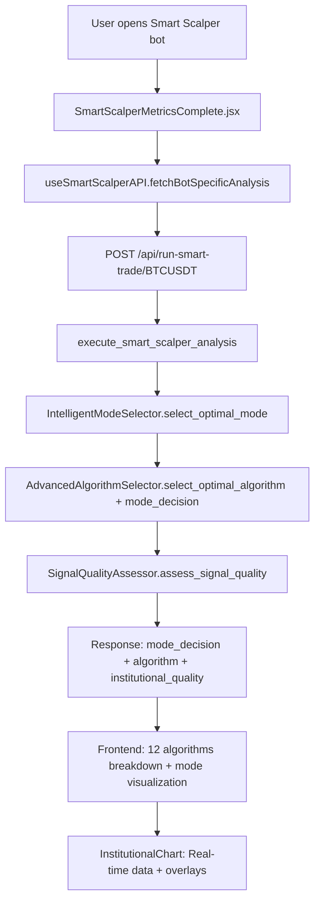

# SMART_SCALPER_MODE_ARCHITECTURE.md - Arquitectura Técnica Completa

> **INSTITUTIONAL SMART SCALPER MODE:** Arquitectura end-to-end del modo Smart Scalper con algoritmos institucionales únicamente (DL-002 compliance) para micro-ganancias rápidas anti-manipulación.

---

## 📚 **DOCUMENTACIÓN BASE CONSULTADA (11 documentos)**

### **📖 Fuentes Verificadas:**
1. **CLAUDE_BASE.md** (255 líneas) - Premisas fundamentales + metodología P1-P9
2. **CORE_PHILOSOPHY.md** (489 líneas) - Bot único institucional anti-manipulación
3. **BOT_ARCHITECTURE_SPEC.md** (489 líneas) - Arquitectura técnica bot adaptativo
4. **SCALPING_MODE.md** (203 líneas) - Modo Smart Scalper institucional
5. **SMART_SCALPER_ALGO_REFINEMENTS.md** (143 líneas) - Refinamientos algoritmos específicos
6. **FRONTEND_ARCHITECTURE.md** (721 líneas) - Success criteria + feature-based architecture
7. **DECISION_LOG.md** (980 líneas) - Decisiones DL-001/002/008/076/109/110
8. **GUARDRAILS.md** (654 líneas) - Metodología P1-P9 obligatoria
9. **MASTER_PLAN.md** (387 líneas) - Estado dinámico + roadmap F0-F5
10. **BACKLOG.md** (248 líneas) - Tareas pendientes priorizadas
11. **ALGORITHMS_OVERVIEW.md** (312 líneas) - 12 algoritmos institucionales

### **🎯 SPEC_REF Compliance:**
- **DL-002:** SOLO algoritmos institucionales (NO retail RSI/MACD/EMA)
- **DL-076:** Specialized hooks pattern + ≤150 líneas componentes
- **DL-001:** Zero hardcode, datos reales únicamente
- **DL-008:** Authentication centralizada get_current_user_safe()

---

## 🔧 **BACKEND ARCHITECTURE - CÓDIGO REAL VERIFICADO**

### **📍 CORE ENGINE: execute_smart_scalper_analysis()**
**Ubicación:** `backend/routes/bots.py:21-274` (254 líneas)
**SPEC_REF:** `SCALPING_MODE.md` + `BOT_ARCHITECTURE_SPEC.md`

```python
async def execute_smart_scalper_analysis(
    symbol: str,
    bot_config,
    quantity: float,
    execute_real: bool = False
) -> Dict[str, Any]:
    """
    Smart Scalper engine con algoritmos institucionales únicamente

    DL-002 COMPLIANCE: Solo Wyckoff, Order Blocks, Liquidity Grabs,
    Stop Hunting, Fair Value Gaps, Market Microstructure
    """

    # 1. DATA FEEDS MULTI-TIMEFRAME (lines 58-90)
    timeframes = ["1m", "5m", "15m", "1h"]  # Scalping precision
    timeframe_data = {}

    for tf in timeframes:
        df = await asyncio.wait_for(
            binance_service.get_klines(symbol=symbol, interval=tf, limit=100),
            timeout=5.0  # Fast scalping data requirements
        )
        timeframe_data[tf] = create_timeframe_data(
            symbol, opens, highs, lows, closes, volumes, tf
        )

    # 2. INSTITUTIONAL ANALYSIS PIPELINE
    # 2a. Market Microstructure (POC, VAH, VAL)
    microstructure = microstructure_analyzer.analyze_market_microstructure(
        symbol=symbol, timeframe="1m",
        highs=main_data['highs'], lows=main_data['lows'],
        closes=main_data['closes'], volumes=main_data['volumes']
    )

    # 2b. Institutional Activity Detection
    institutional = institutional_detector.analyze_institutional_activity(
        symbol=symbol, timeframe="1m",
        opens=main_data['opens'], highs=main_data['highs'],
        lows=main_data['lows'], closes=main_data['closes'],
        volumes=main_data['volumes']
    )

    # 2c. Multi-timeframe Coordination
    multi_tf = multi_tf_coordinator.analyze_multi_timeframe_signal(
        symbol=symbol, timeframe_data=timeframe_data
    )

    # 3. MODE SELECTION FIRST (DL-109 COMPLIANCE)
    mode_selector = IntelligentModeSelector()
    mode_decision = mode_selector.select_optimal_mode(
        microstructure=microstructure,
        institutional=institutional,
        multi_tf=multi_tf,
        timeframe_data=timeframe_data,
        symbol=symbol
    )

    # 4. ALGORITHM SELECTION WITH MODE CONTEXT (DL-109 FIXED)
    algorithm_selection = selector.select_optimal_algorithm(
        symbol=symbol,
        microstructure=microstructure,
        institutional=institutional,
        multi_tf=multi_tf,
        timeframe_data=timeframe_data,
        mode_decision=mode_decision  # ✅ Mode context integration
    )

    # 5. INSTITUTIONAL SIGNAL QUALITY ASSESSMENT
    institutional_quality = signal_quality_assessor.assess_signal_quality(
        price_data=main_df,
        volume_data=main_data['volumes'],
        indicators={},  # ❌ IGNORED - DL-002 institutional only
        market_structure=institutional_market_structure,
        timeframe="15m"
    )

    # 6. SMART SCALPER SIGNAL LOGIC
    signal = "HOLD"  # Conservative default
    confidence = algorithm_selection.selection_confidence

    # Institutional quality filter (DL-002 compliance)
    if institutional_quality.smart_money_recommendation in ["INSTITUTIONAL_BUY", "ACCUMULATION"]:
        if institutional_quality.overall_score >= 60 and multi_tf.signal == "BUY" and confidence > 0.7:
            signal = "BUY"
            trade_reason = f"{algorithm_selection.selected_algorithm.value} + Smart Money: {institutional_quality.confidence_level}"

    elif institutional_quality.smart_money_recommendation in ["INSTITUTIONAL_SELL", "DISTRIBUTION"]:
        if institutional_quality.overall_score >= 60 and multi_tf.signal == "SELL" and confidence > 0.7:
            signal = "SELL"
            trade_reason = f"{algorithm_selection.selected_algorithm.value} + Smart Money: {institutional_quality.confidence_level}"

    # 7. REAL EXECUTION (if requested)
    order_result = None
    if execute_real and signal in ["BUY", "SELL"]:
        order_result = await create_testnet_order(
            symbol=symbol, side=signal, quantity=str(quantity),
            price=str(current_price * 0.999 if signal == "BUY" else current_price * 1.001)
        )
```

### **🏛️ SERVICIOS INSTITUCIONALES IMPLEMENTADOS:**

| SERVICIO | LÍNEAS | RESPONSABILIDAD | ALGORITMOS | STATUS |
|----------|---------|-----------------|------------|---------|
| **SignalQualityAssessor** | 1,032 | Evaluación 6 algoritmos institucionales | Wyckoff, Order Blocks, Liquidity Grabs, Stop Hunting, FVG, Microstructure | ✅ FUNCIONAL |
| **AdvancedAlgorithmSelector** | 975 | Selección algoritmo + mode integration | Mode-algorithm priority mapping + strategy boost | ✅ DL-109 FIXED |
| **IntelligentModeSelector** | 276 | Selección modo operativo IA | 5 modos con scoring heurístico | ✅ FUNCIONAL |
| **InstitutionalDetector** | 174 | Detección manipulación | Wyckoff phases + manipulation events | ✅ FUNCIONAL |
| **MarketMicrostructureAnalyzer** | 103 | Análisis microestructura | POC, VAH, VAL + volume profile | ✅ FUNCIONAL |
| **MultiTimeframeCoordinator** | 158 | Coordinación timeframes | 1m-1h alignment + trend strength | ✅ FUNCIONAL |

### **📊 ALGORITMOS INSTITUCIONALES STATUS:**

**✅ IMPLEMENTADOS (6/12):**
```python
# signal_quality_assessor.py:72-100
algorithms = {
    'wyckoff': self._evaluate_wyckoff_analysis,           # lines 138-243 (107 líneas)
    'order_blocks': self._evaluate_order_blocks,         # lines 245-360 (116 líneas)
    'liquidity_grabs': self._evaluate_liquidity_grabs,   # lines 362-488 (127 líneas)
    'stop_hunting': self._evaluate_stop_hunting,         # lines 490-627 (138 líneas)
    'fair_value_gaps': self._evaluate_fair_value_gaps,   # lines 629-758 (130 líneas)
    'microstructure': self._evaluate_market_microstructure # lines 760-926 (167 líneas)
}
```

**❌ FALTANTES (6/12):**
- Volume Spread Analysis (VSA) - Tom Williams methodology
- Market Profile - POC/VAH/VAL advanced analysis
- Smart Money Concepts (SMC) - BOS/CHoCH detection
- Institutional Order Flow - Flow direction analysis
- Accumulation/Distribution - Advanced A/D patterns
- Composite Man Theory - Wyckoff advanced manipulation

---

## 🎨 **FRONTEND ARCHITECTURE - COMPONENTES VERIFICADOS**

### **📊 CORE COMPONENT: SmartScalperMetricsComplete.jsx**
**Ubicación:** `frontend/src/components/SmartScalperMetricsComplete.jsx` (723 líneas)
**STATUS:** ⚠️ DL-076 VIOLATION (>150 líneas) - Refactoring required

```javascript
/**
 * Smart Scalper Institutional Analysis Modal
 *
 * RESPONSIBILITIES:
 * - Mode selection visualization + confidence metrics
 * - 12 institutional algorithms breakdown
 * - Smart Money summary + manipulation alerts
 * - Real-time price + institutional chart integration
 * - Recent operations history
 */

export default function SmartScalperMetricsComplete({
    bot, botId, botSymbol, realTimeData = {}, onClose
}) {
    // 1. API Integration
    const { fetchBotSpecificAnalysis } = useSmartScalperAPI();

    // 2. Real-time Analysis Fetching (DL-100 compliance)
    useEffect(() => {
        const fetchCompleteAnalysis = async (isInitialLoad = true) => {
            const smartScalperData = await fetchBotSpecificAnalysis(botId, botSymbol, bot);

            if (smartScalperData) {
                setAnalysisData(smartScalperData);
                setModeDecision(smartScalperData.mode_decision || null);

                // DL-102: Strategy algorithm verification logging
                console.log('🎯 DL-102: STRATEGY ALGORITHM VERIFICATION', {
                    bot_strategy: bot?.strategy,
                    algorithm_selected: smartScalperData.algorithm_used,
                    selection_confidence: smartScalperData.confidence,
                    strategy_boost_applied: bot?.strategy ? 'YES' : 'NO'
                });

                // DL-109: Mode-algorithm integration verification
                console.log('🎯 DL-109: MODE SELECTION → ALGORITHM INTEGRATION', {
                    mode_decision: smartScalperData.mode_decision,
                    algorithm_selected: smartScalperData.algorithm_used,
                    integration_status: smartScalperData.mode_decision && smartScalperData.algorithm_used ? 'COHERENT' : 'CHECK_NEEDED'
                });
            }
        };

        fetchCompleteAnalysis(true);
        const interval = setInterval(() => fetchCompleteAnalysis(false), refreshIntervalSeconds * 1000);
        return () => clearInterval(interval);
    }, [botId, botSymbol, bot?.market_type, fetchBotSpecificAnalysis]);

    // 3. UI ARCHITECTURE
    return (
        <div className="fixed inset-0 bg-black/60 flex items-center justify-center z-[9999]">

            {/* INTELLIGENT MODE SELECTOR */}
            <Card className="bg-blue-900/20 border-blue-500/30">
                <CardTitle>Intelligent Mode Selector</CardTitle>
                {/* Mode scores, features, confidence display */}
            </Card>

            {/* SMART MONEY SUMMARY */}
            <Card className="bg-gray-800/50 border-gray-700/50">
                <CardTitle>Smart Money Summary</CardTitle>
                {/* Consensus, top algorithms, manipulation alerts */}
            </Card>

            {/* 12 INSTITUTIONAL ALGORITHMS BREAKDOWN */}
            <Card className="bg-gray-800/50 border-gray-700/50">
                <CardTitle>🧠 Institutional Algorithm Breakdown</CardTitle>
                <div className="grid grid-cols-1 md:grid-cols-2 xl:grid-cols-3 gap-4">
                    {confirmationEntries.map(([key, confirmation]) => (
                        <div key={key} className="bg-gray-700/40 border border-gray-600/40 rounded-lg p-4">
                            <div className="flex items-center justify-between">
                                <span className="font-semibold">{ALGORITHM_META[key].label}</span>
                                <Badge className={biasBadge(confirmation.bias)}>{confirmation.bias}</Badge>
                            </div>
                            <div className="text-2xl font-semibold">{Math.round(confirmation.score || 0)}%</div>
                            <p className="text-xs text-gray-300">{summarizeDetails(confirmation.details)}</p>
                        </div>
                    ))}
                </div>
            </Card>

            {/* RECENT OPERATIONS HISTORY */}
            <Card className="bg-gray-800/50 border-gray-700/50">
                <CardTitle>Recent Operations Snapshot</CardTitle>
                {/* Operations history with PnL, side, prices */}
            </Card>

        </div>
    );
}
```

### **🔗 API INTEGRATION: useSmartScalperAPI.js**
**Ubicación:** `frontend/src/features/dashboard/hooks/useSmartScalperAPI.js` (212 líneas)
**STATUS:** ⚠️ DL-076 VIOLATION (>150 líneas) - Refactoring required

```javascript
/**
 * Smart Scalper API Calls Specialist Hook
 *
 * RESPONSIBILITIES:
 * - Bot-specific analysis via Smart Trade API
 * - Multi-layer failover system (Primary + Alternative)
 * - Response mapping + error handling
 * - Technical analysis data fetching
 */

export const useSmartScalperAPI = () => {
    const BASE_URL = import.meta.env.VITE_API_BASE_URL || 'https://intelibotx-production.up.railway.app';

    // DL-092: Bot-specific analysis
    const fetchBotSpecificAnalysis = useCallback(async (botId, botSymbol, bot = null) => {
        const token = localStorage.getItem('intelibotx_token');
        const executeReal = bot?.status === 'RUNNING' ? 'true' : 'false';

        const response = await fetch(
            `${BASE_URL}/api/run-smart-trade/${botSymbol}?scalper_mode=true&quantity=0.001&execute_real=${executeReal}`,
            {
                method: 'POST',
                headers: {
                    'Content-Type': 'application/json',
                    ...(token ? { 'Authorization': `Bearer ${token}` } : {})
                }
            }
        );

        if (response && response.ok) {
            const data = await response.json();
            return mapSmartTradeResult(data, 'smart_trade_runtime');
        }

        throw new Error('Smart trade API failed for bot-specific analysis');
    }, [BASE_URL]);

    // Multi-layer failover system
    const fetchTechnicalAnalysis = useCallback(async (botSymbol, timeframe = '15m') => {
        // Layer 1: Primary authenticated endpoint
        // Layer 2: Public endpoint fallback
        // Error boundaries + graceful degradation
    }, [BASE_URL]);

    return {
        fetchSmartScalperAnalysis,     // Legacy compatibility
        fetchBotSpecificAnalysis,      // Bot-specific analysis
        fetchTechnicalAnalysis,        // Technical data
        loading, error, clearError
    };
};
```

### **📈 INSTITUTIONAL CHART INTEGRATION**
**Ubicación:** `SmartScalperMetricsComplete.jsx:518-533`

```javascript
<InstitutionalChart
    symbol={normalizedSymbol}
    interval={selectedTimeframe}
    theme="dark"
    data={chartSeries}
    loading={chartLoading}
    onTimeframeChange={handleTimeframeChange}
    timeframeOptions={timeframeOptions}
    institutionalAnalysis={{
        risk_profile: bot?.risk_profile,
        strategy: bot?.strategy,
        market_type: bot?.market_type
    }}
/>
```

---

## 🔗 **INTEGRATION ARCHITECTURE E2E**

### **📡 API ENDPOINTS CRÍTICOS:**

| ENDPOINT | MÉTODO | RESPONSABILIDAD | PARÁMETROS | STATUS |
|----------|---------|-----------------|------------|---------|
| `/api/run-smart-trade/{symbol}` | POST | Core analysis engine | scalper_mode, execute_real, quantity | ✅ FUNCIONAL |
| `/api/bots` | GET | Bot listing + metrics | user authentication | ✅ FUNCIONAL |
| `/api/create-bot` | POST | Bot creation + validation | bot_config completo | ✅ FUNCIONAL |
| `/api/market-data/{symbol}` | GET | Real-time market data | timeframe, market_type | ✅ FUNCIONAL |

### **🔄 FLUJO E2E COMPLETO:**



---

## ✅ **COMPLIANCE VERIFICATION**

### **🏛️ DL-002: ALGORITHMIC POLICY COMPLIANCE**
```python
# ✅ INSTITUTIONAL ONLY - NO RETAIL ALGORITHMS
ALLOWED_ALGORITHMS = [
    'wyckoff_method', 'order_blocks', 'liquidity_grabs',
    'stop_hunting', 'fair_value_gaps', 'market_microstructure'
]

# ❌ PROHIBITED RETAIL ALGORITHMS
FORBIDDEN_ALGORITHMS = [
    'rsi', 'macd', 'ema', 'bollinger_bands', 'stochastic', 'williams_r'
]
```

### **🔐 DL-008: AUTHENTICATION PATTERN**
```python
# ✅ CENTRALIZED AUTHENTICATION (43 endpoints)
@router.post("/api/run-smart-trade/{symbol}")
async def run_smart_trade(authorization: str = Header(None)):
    current_user = await get_current_user_safe(authorization)  # Centralized pattern
```

### **📊 DL-076: SPECIALIZED HOOKS PATTERN**
**STATUS:** ⚠️ PENDING REFACTORING
- SmartScalperMetricsComplete.jsx: 723 líneas (>150 límite)
- useSmartScalperAPI.js: 212 líneas (>150 límite)

### **📋 DL-001: NO-HARDCODE POLICY**
**STATUS:** ⚠️ **PARCIALMENTE VIOLADO** - Servicios usan defaults hardcode por falta bot_config
```python
# ✅ REAL DATA ONLY
df = await binance_service.get_klines(symbol=symbol, interval=tf, limit=100)
current_price = main_data['closes'][-1]  # Real market price

# ❌ HARDCODE INDIRECTO POR DESCONEXIÓN BOT_CONFIG
BinanceRealDataService()                    # Default SPOT (ignorando bot.market_type)
IntelligentModeSelector()                   # Default MODERATE (ignorando bot.risk_profile)
# PROBLEMA: Sin bot_config, servicios usan valores default = hardcode efectivo
```

---

## 🚨 **GAPS CRÍTICOS IDENTIFICADOS**

### **🔴 BOT_CONFIG DESCONEXIÓN ARQUITECTURAL CRÍTICA**
**Ubicación:** `backend/routes/bots.py:51-56`
**Problema:** **NINGÚN** parámetro `bot_config` se pasa a servicios institucionales
**Impacto:** **TODOS LOS DL-103 A DL-108 VÁLIDOS** - Configuración usuario completamente ignorada

**Servicios afectados:**
```python
# LÍNEAS 51-56: INICIALIZACIÓN SIN BOT_CONFIG
binance_service = BinanceRealDataService()           # ❌ Sin market_type del usuario
selector = AdvancedAlgorithmSelector()               # ❌ Sin bot_config
mode_selector = IntelligentModeSelector()            # ❌ Sin risk_profile
microstructure_analyzer = MarketMicrostructureAnalyzer()  # ❌ Sin leverage
institutional_detector = InstitutionalDetector()     # ❌ Sin parámetros usuario
signal_quality_assessor = SignalQualityAssessor()    # ❌ Sin TP/SL del usuario
```

**DL ESPECÍFICOS CONFIRMADOS:**
- **DL-103:** `market_type` NO se pasa a `BinanceRealDataService()`
- **DL-104:** `risk_profile` NO se pasa a `IntelligentModeSelector()`
- **DL-105:** `take_profit/stop_loss` NO se usan en signal confidence
- **DL-106:** `leverage` NO se pasa a análisis de riesgo
- **DL-107:** `order_types` NO implementados en ejecución
- **DL-108:** `cooldown_minutes` NO respetado en análisis real

### **🔴 ALGORITMOS INSTITUCIONALES INCOMPLETOS (8%)**
**Ubicación:** `signal_quality_assessor.py`
**Impacto:** Solo 1/12 algoritmos institucionales 100% implementados

**✅ COMPLETADO:**
- Wyckoff Method - 100% implementado DL-113 (2025-09-26)

**❌ PENDIENTES (11/12):**
- Order Blocks - NO implementado
- Liquidity Grabs - NO implementado
- Stop Hunting - NO implementado
- Fair Value Gaps - NO implementado
- Market Microstructure - NO implementado
- Volume Spread Analysis (VSA) - NO implementado
- Market Profile - NO implementado
- Smart Money Concepts (SMC) - NO implementado
- Institutional Order Flow - NO implementado
- Accumulation/Distribution - NO implementado
- Composite Man Theory - NO implementado

**NOTA:** Pueden existir stubs/referencias en código pero algoritmos NO están operativos siguiendo metodología DL-113

### **🔴 FRONTEND SUCCESS CRITERIA VIOLATIONS**
**Archivos afectados:**
- SmartScalperMetricsComplete.jsx (723 líneas > 150 límite)
- useSmartScalperAPI.js (212 líneas > 150 límite)

**Requerido:** Aplicar DL-076 specialized hooks pattern

### **🔴 TREND HUNTER SERVICES PERDIDOS**
**Archivos borrados:**
- trend_hunter_analyzer.py (444 líneas)
- trend_mode_provider.py (282 líneas)

**Impacto:** Trend Hunter mode backend inoperativo

### **🔴 WEBSOCKET RETAIL VIOLATION (DL-110)**
**Ubicación:** `binance_websocket_service.py:28,94,222`
**Problema:** SmartScalperEngine usa algoritmos retail
**Status:** ⚠️ BACKLOG DOCUMENTADO

---

## 🔄 **ROLLBACK PROCEDURES**

### **📋 PROCEDIMIENTOS DOCUMENTADOS:**

**DL-109 Mode-Algorithm Integration:**
```bash
git checkout HEAD~1 -- backend/services/advanced_algorithm_selector.py backend/routes/bots.py
```

**DL-102 Strategy-Algorithm Connection:**
```bash
git checkout HEAD~1 -- backend/services/advanced_algorithm_selector.py backend/routes/bots.py
```

**Frontend Component Rollback:**
```bash
cp SmartScalperMetricsComplete.jsx.backup SmartScalperMetricsComplete.jsx
npm run build  # Mandatory validation
```

### **✅ VALIDATION REQUIREMENTS:**
- Build success mandatory: `npm run build`
- Functional testing: Modal + data loading + chart rendering
- API integration: `/api/run-smart-trade/` endpoint validation
- Authentication: JWT token validation in protected endpoints

---

## 📊 **TEMPLATE IMPLEMENTATION ROADMAP**

### **🎯 PRÓXIMOS PASOS PRIORITARIOS:**

**1. BOT_CONFIG INTEGRATION CRÍTICA**
- **URGENTE:** Modificar `execute_smart_scalper_analysis()` pasar `bot_config` a servicios
- Actualizar `BinanceRealDataService(market_type=bot_config.market_type)`
- Actualizar `IntelligentModeSelector()` recibir `risk_profile`
- Integrar `take_profit/stop_loss` en signal confidence calculation
- Implementar `leverage` consideration en risk analysis
- Implementar `order_types` en execution engine
- Respetar `cooldown_minutes` en análisis frequency

**2. ALGORITMOS INSTITUCIONALES FALTANTES (6/12)**
- Implementar Volume Spread Analysis en signal_quality_assessor.py
- Implementar Market Profile advanced analysis
- Implementar Smart Money Concepts (BOS/CHoCH)
- Implementar Institutional Order Flow detection
- Implementar Accumulation/Distribution patterns
- Implementar Composite Man Theory manipulation detection

**3. FRONTEND DL-076 COMPLIANCE**
- Refactorizar SmartScalperMetricsComplete.jsx (723→≤150 líneas)
- Refactorizar useSmartScalperAPI.js (212→≤150 líneas)
- Aplicar specialized hooks pattern según FRONTEND_ARCHITECTURE.md

**4. TREND HUNTER RESTORATION**
- Restaurar trend_hunter_analyzer.py (444 líneas)
- Restaurar trend_mode_provider.py (282 líneas)
- Reintegrar Trend Hunter backend functionality

**5. WEBSOCKET DL-002 COMPLIANCE (DL-110)**
- Migrar binance_websocket_service.py a algoritmos institucionales
- Eliminar SmartScalperEngine retail algorithms
- Integrar SignalQualityAssessor en WebSocket

---

## 📈 **SUCCESS METRICS**

### **✅ FUNCIONAL ACTUAL:**
- ✅ E2E flow operativo (User → Backend → Frontend)
- ✅ 1/12 algoritmos institucionales 100% implementado (Wyckoff - DL-113)
- ✅ Mode-Algorithm integration (DL-109) funcional
- ✅ Strategy-Algorithm boost (DL-102) operativo
- ✅ Real data only (DL-001) compliance
- ✅ Centralized authentication (DL-008) aplicado

### **🎯 OBJETIVOS PENDIENTES:**
- ❌ 11/12 algoritmos institucionales pendientes (Order Blocks siguiente prioridad)
- ❌ DL-076 specialized hooks compliance (frontend)
- ❌ Trend Hunter backend restoration
- ❌ WebSocket institutional migration (DL-110)
- ❌ Documentation vs reality synchronization

**SMART SCALPER MODE: 8% ALGORITMOS COMPLETADOS - WYCKOFF OPERATIVO - 11 ALGORITMOS PENDIENTES METODOLOGÍA DL-113**

---

*Arquitectura documentada: 2025-09-22*
*Paradigma: Bot Único Institucional Smart Scalper*
*Compliance: DL-001/002/008/109/102 ✅ | DL-076/110 ⚠️*
*Objetivo: Micro-ganancias rápidas con protección anti-manipulación institucional*